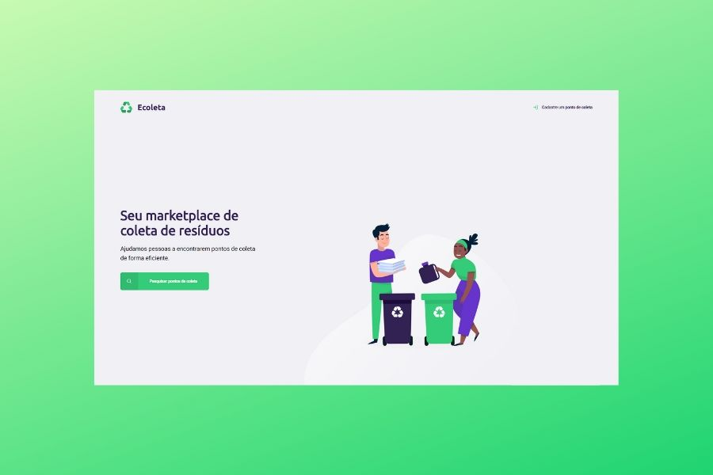
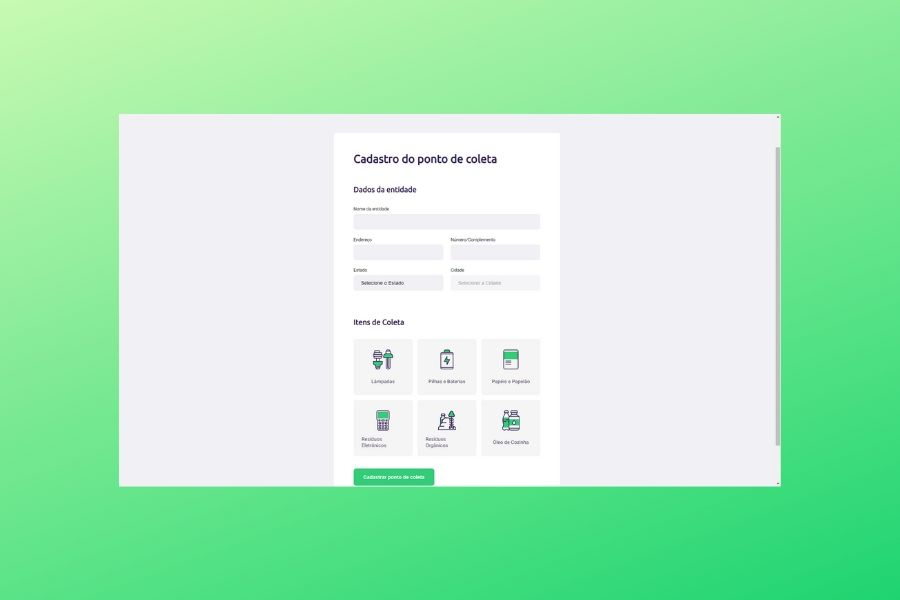
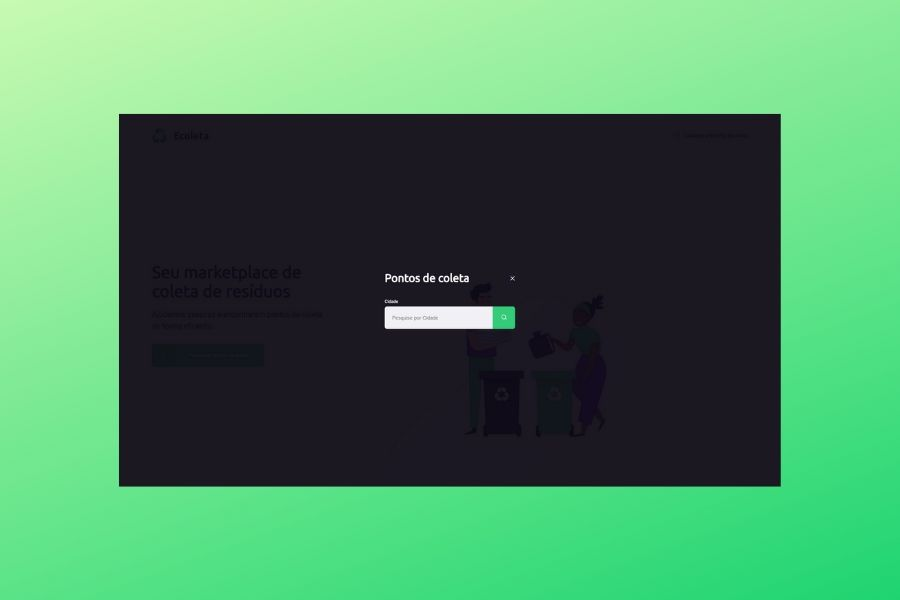
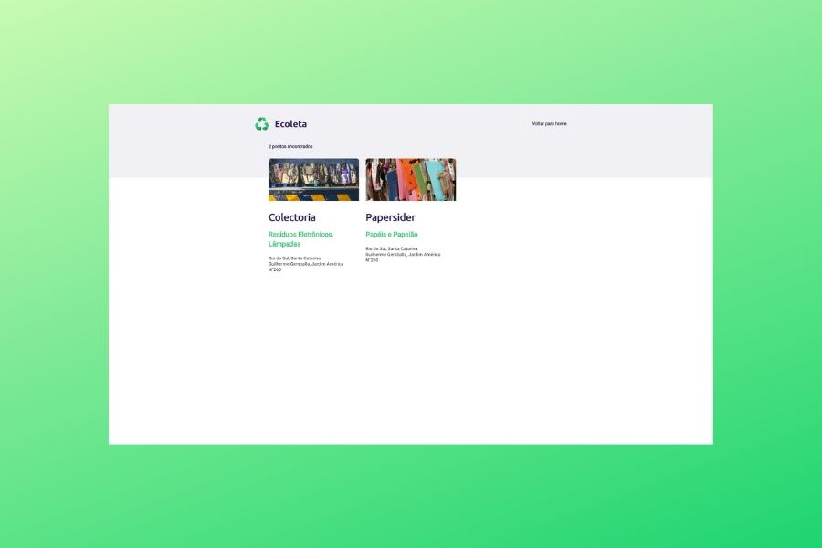

## Cadastro de ponto de coleta

> Projeto criado na  Next Level Week, da comunidade Rocketseat, onde podemos cadastrar pontos de coleta seletiva.

[Website (Vercel)](https://ecoleta-static.vercel.app/)

## Caractéristicas utilizadas:

- Página inicial
- Página de cadastro de Ponto de coleta
- Formulário de contato

- API de localidades, por Estados e municípios

Foi estudado e aprendido várias técnicas de estilização no CSS, como aproveitar o uso de flexbox
e ainda, dividir os arquivos.css em partes a fim de manter a organização.

No Javascript foi feito o uso de funções e o mais interessante, foi o meu primeiro contato com uma API, além de aprender atalhos de comandos como arrow function, para minimizar as linhas de código.

### Aula 1

- Página inicial com com imagens, botões e fontes intuitivas.

### Aula 2

- Formulário de contato, contendo dados inicias e uma comunicação com uma [API de serviços de dados para localidades](https://servicodados.ibge.gov.br/api/docs/localidades?versao=1).

- Também foi explorado em Javascript a utilização de eventos para cliques, bem como a seleção dos itens de coleta, registrando seus ids na barra de endereço.

### Aula 3

- Função modal e página de resultados de pesquisa, preparando o terreno para o Back End

### Este projeto está em desenvolvimento durante a semana, portanto terá várias modificações.
